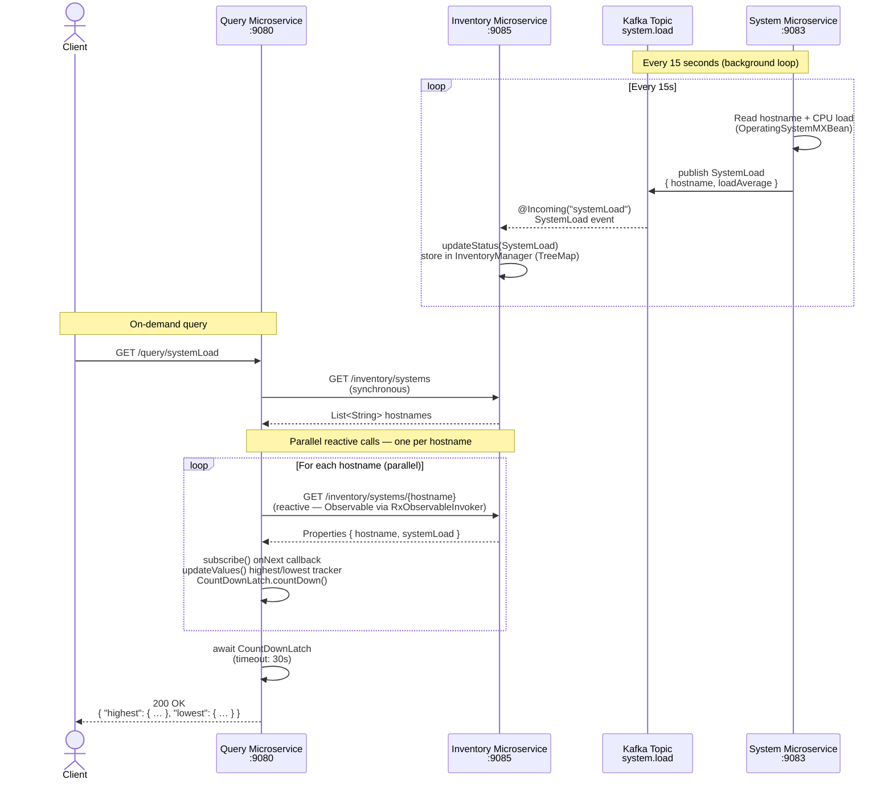

# Microservice Interaction Sequence Diagram

## Overview

This guide demonstrates three microservices communicating via two mechanisms:

- **Event-driven** (Apache Kafka): System Microservice → Inventory Microservice
- **Reactive REST** (JAX-RS reactive client with Jersey RxJava): Query Microservice → Inventory Microservice

## Services

| Service                | Port | Role                                          |
|------------------------| ---- | --------------------------------------------- |
| System Microservice    | 9083 | Publishes CPU load metrics to Kafka every 15s |
| Inventory Microservice | 9085 | Stores metrics; exposes REST endpoints        |
| Query Microservice     | 9080 | Aggregates metrics via reactive JAX-RS calls  |

---

## Sequence Diagram



---

## Key Design Details

### System → Inventory (Kafka)

- The System Microservice uses `@Outgoing("systemLoad")` with RxJava3 `Flowable.interval` to emit a `SystemLoad` object every 15 seconds.
- The Inventory Microservice uses `@Incoming("systemLoad")` to receive events and persists them in an `InventoryManager` backed by a `TreeMap`.
- **`system.load` Kafka topic** is the message channel between the two services. It decouples them completely — the System Microservice doesn't know the Inventory Microservice exists, and vice versa. Either service can be scaled, restarted, or replaced independently without affecting the other.

### Query → Inventory (Reactive JAX-RS Client)

The guide builds the client in two stages:

**Stage 1 — Default JAX-RS reactive provider (`defaultrx`)**

- `InventoryClient.getSystem()` returns `CompletionStage<Properties>` using the built-in `CompletionStageRxInvoker` (`.rx()` with no arguments).
- `QueryResource` uses `thenAcceptAsync()` + `exceptionally()` to process responses.
- No extra dependencies required.

**Stage 2 — Jersey RxJava provider (`finish`)**

- `InventoryClient.getSystem()` returns `rx.Observable<Properties>` by registering `RxObservableInvokerProvider` and calling `.rx(RxObservableInvoker.class)`.
- `QueryResource` switches from `thenAcceptAsync()` to `Observable.subscribe()` with inline success and error lambdas.
- Enables richer RxJava composition operators and a path to `Flowable`-based backpressure if needed.

In both stages:

- `getSystems()` is **synchronous** — the hostname list must be known before launching parallel fetches.
- A `CountDownLatch` (initialised to the number of hostnames) coordinates completion. Each callback decrements the latch; the main thread waits with a 30-second timeout before returning the aggregated result.
- A `ConcurrentHashMap` accumulates results safely across threads.
- The `INVENTORY_BASE_URI` config property controls the Inventory Microservice base URL, allowing it to be overridden per environment (e.g. pointing to MockServer during tests).

### Data Model

```
SystemLoad
├── hostname:    String   (e.g. "inventory-service-host")
└── loadAverage: Double  (system CPU load, -1.0 if unavailable)
```

Custom JSONB-backed Kafka serializers/deserializers are defined as inner classes on `SystemLoad`, shared by both the System and Inventory microservices via the `models` module.
